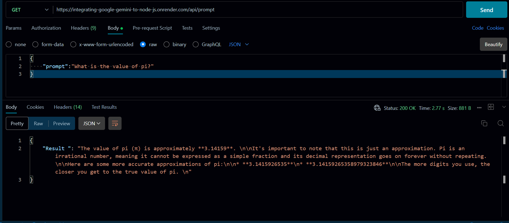

# Integrating Google Gemini to Node JS Application

## Live Link : [Node JS App](https://integrating-google-gemini-to-node-js.onrender.com/)

### API Endpoint :: 
####     ```/api/prompt```

### The API endpoint allows you to retrieve information based on your prompt. When accessing this endpoint, you will receive a response containing information based on the question you entered in the prompt.

### API : ```https://integrating-google-gemini-to-node-js.onrender.com/api/prompt ``` 

#### In body you can pass prompt by using JSON :
###  ```{"prompt":"what is the value of PI?" }``` 

#

